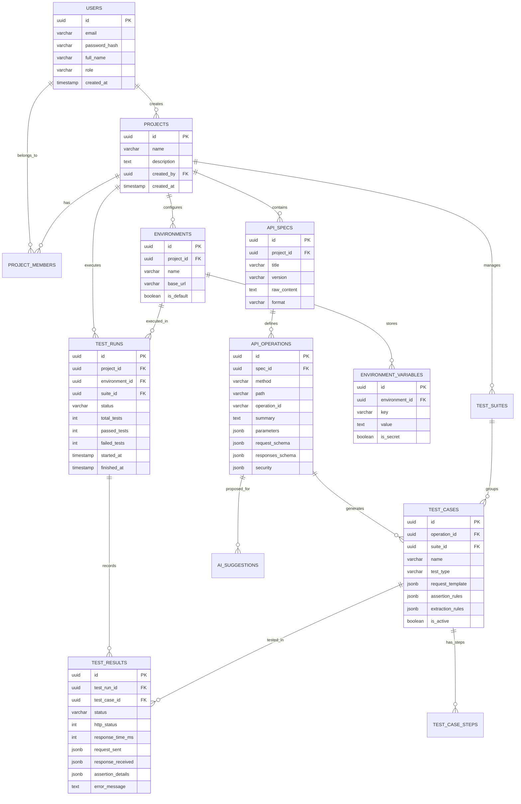

# Thiết kế sơ đồ quan hệ thực thể (ERD)

## 1. Sơ đồ Mermaid ERD

```mermaid
erDiagram
    USERS ||--o{ PROJECTS : "creates"
    USERS ||--o{ PROJECT_MEMBERS : "belongs_to"
    PROJECTS ||--o{ PROJECT_MEMBERS : "has"
    PROJECTS ||--o{ ENVIRONMENTS : "configures"
    PROJECTS ||--o{ API_SPECS : "contains"
    PROJECTS ||--o{ TEST_SUITES : "manages"
    PROJECTS ||--o{ TEST_RUNS : "executes"

    ENVIRONMENTS ||--o{ ENVIRONMENT_VARIABLES : "stores"

    API_SPECS ||--o{ API_OPERATIONS : "defines"
    API_OPERATIONS ||--o{ TEST_CASES : "generates"

    TEST_SUITES ||--o{ TEST_CASES : "groups"
    TEST_CASES ||--o{ TEST_CASE_STEPS : "has_steps"

    TEST_RUNS ||--o{ TEST_RESULTS : "records"
    ENVIRONMENTS ||--o{ TEST_RUNS : "executed_in"
    TEST_CASES ||--o{ TEST_RESULTS : "tested_in"

    API_OPERATIONS ||--o{ AI_SUGGESTIONS : "proposed_for"

    USERS {
        uuid id PK
        varchar email
        varchar password_hash
        varchar full_name
        varchar role
        timestamp created_at
    }

    PROJECTS {
        uuid id PK
        varchar name
        text description
        uuid created_by FK
        timestamp created_at
    }

    ENVIRONMENTS {
        uuid id PK
        uuid project_id FK
        varchar name
        varchar base_url
        boolean is_default
    }

    ENVIRONMENT_VARIABLES {
        uuid id PK
        uuid environment_id FK
        varchar key
        text value
        boolean is_secret
    }

    API_SPECS {
        uuid id PK
        uuid project_id FK
        varchar title
        varchar version
        text raw_content
        varchar format
    }

    API_OPERATIONS {
        uuid id PK
        uuid spec_id FK
        varchar method
        varchar path
        varchar operation_id
        text summary
        jsonb parameters
        jsonb request_schema
        jsonb responses_schema
        jsonb security
    }

    TEST_CASES {
        uuid id PK
        uuid operation_id FK
        uuid suite_id FK
        varchar name
        varchar test_type
        jsonb request_template
        jsonb assertion_rules
        jsonb extraction_rules
        boolean is_active
    }

    TEST_RUNS {
        uuid id PK
        uuid project_id FK
        uuid environment_id FK
        uuid suite_id FK
        varchar status
        int total_tests
        int passed_tests
        int failed_tests
        timestamp started_at
        timestamp finished_at
    }

    TEST_RESULTS {
        uuid id PK
        uuid test_run_id FK
        uuid test_case_id FK
        varchar status
        int http_status
        int response_time_ms
        jsonb request_sent
        jsonb response_received
        jsonb assertion_details
        text error_message
    }
```
